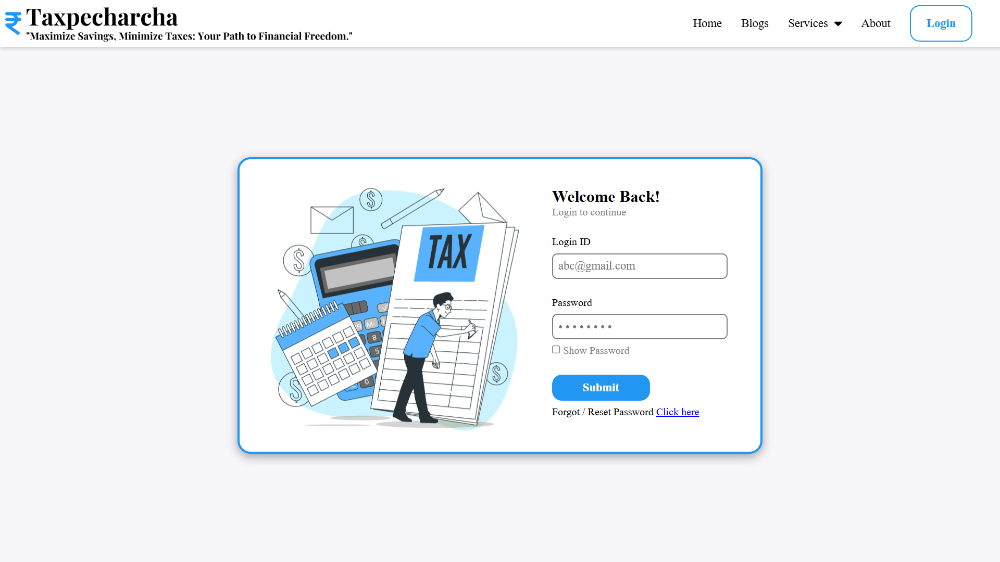
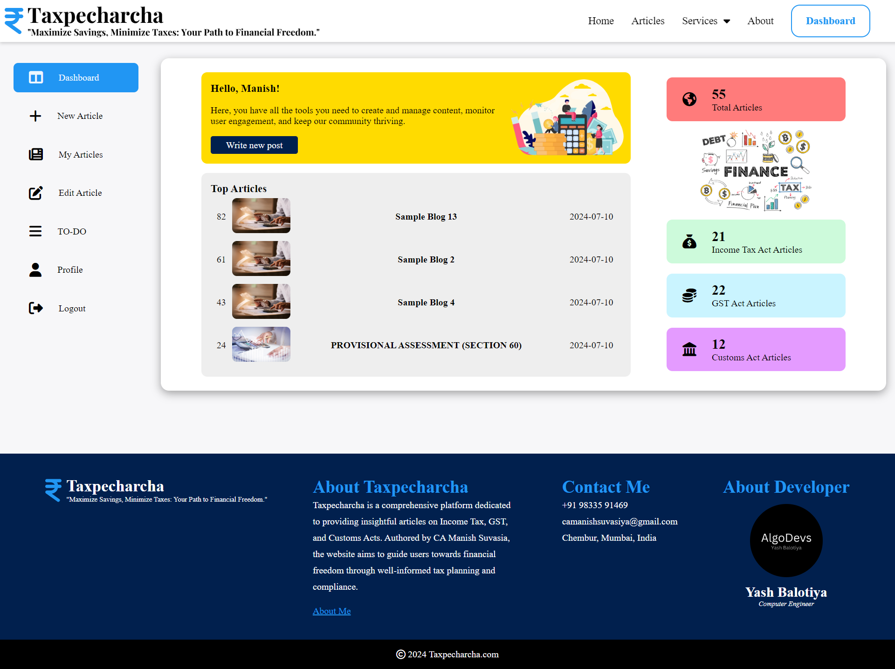
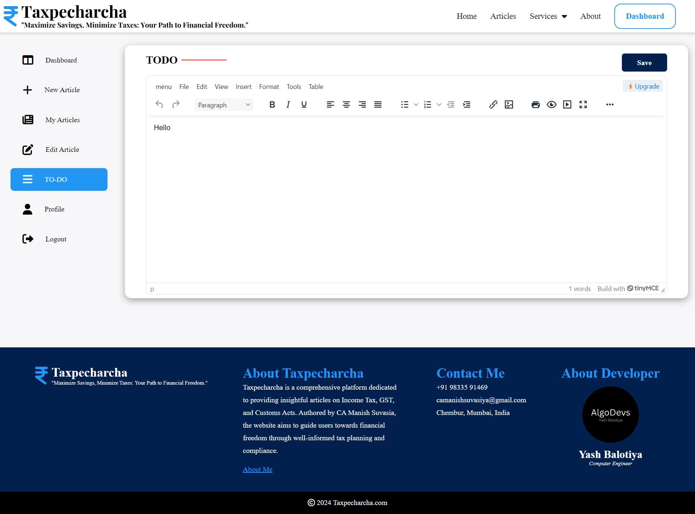

# taxpecharcha
**Maximise Savings, Minimize Taxes: Your Path to Financial Freedom**

## Overview
**taxpecharcha** is a modern, user-friendly website developed for C. A. Manish Suvasia to publish articles related to Income Tax, GST, and Customs Acts. The platform aims to provide valuable insights and guidance to users on various tax laws and regulations in India.

## Table of Contents
1. [Features](#features)
2. [Technologies Used](#technologies-used)
3. [Installation](#installation)
4. [Usage](#usage)
5. [Pages and Navigation](#pages-and-navigation)
   - [Home Page](#home-page)
   - [Articles Page](#articles-page)
   - [Article Detail Page](#article-detail-page)
   - [Services Page](#services-page)
   - [About Page](#about-page)
   - [Admin Login](#admin-login)
   - [Admin Dashboard](#admin-dashboard)
6. [Admin Functionalities](#admin-functionalities)
   - [New Article](#new-article)
   - [Manage Articles](#manage-articles)
   - [To-Do List](#to-do-list)
   - [Profile Management](#profile-management)
7. [UI Design](#ui-design)
8. [Contributing](#contributing)
9. [License](#license)

## Features
- **Responsive Design:** Optimized for desktops, tablets, and mobiles.
- **Categorized Articles:** Articles categorized under The Income Tax Act - 1961, The GST Act - 2017 and The Customs Act - 1962, with subcategories for Acts and Circulars/Notifications.
- **Search Functionality:** Search articles by category or keywords.
- **Admin Dashboard:** Manage articles, view statistics, and handle personal settings.
- **Services Integration:** Quick access to C. A. Manish Suvasia's services via WhatsApp.
- **Secure Admin Login:** Password reset functionality for the admin.
- **Advanced Text Editor:** Utilizes TinyMCE for article creation and editing.

## Technologies Used
- **Frontend:** HTML, CSS, JavaScript, jQuery, AJAX
- **Backend:** PHP
- **Database:** MySQL
- **Text Editor:** TinyMCE

## Installation
1. Clone the repository:
   ```bash
   git clone https://github.com/balotiyash/taxpecharcha.com.git
   ```
2. Navigate to the project directory:
   ```bash
   cd taxpecharcha
   ```
3. Set up the database:
   - Create a new MySQL database.
   - Import the provided SQL file to set up the necessary tables.
4. Update the database configuration in the backend PHP files.
5. Start your local server (e.g., using XAMPP or WAMP).

## Usage
1. Open your browser and navigate to `http://localhost/taxpecharcha.com`.
2. Explore the homepage to view the top and recent articles.
3. Navigate through the articles page, services, and about page via the navbar.
4. Use the search functionality to find specific articles.

## Pages and Navigation

### Home Page
The homepage features the top and recent articles published by C. A. Manish Suvasia. Users can click on any article to read the full content.


### Articles Page
The articles page lists all articles categorized under The Income Tax Act - 1961, The GST Act - 2017, and The Customs Act - 1962. Users can search for articles by category or keyword.


### Article Detail Page
Clicking on an article from the homepage or articles page opens a new page displaying the full content of the article.


### Services Page
The services page includes a submenu with options for Income Tax and GST services. Clicking on these options redirects to C. A. Manish Suvasia's WhatsApp for direct consultation.

### About Page
The about page provides information about CA Manish Suvasia, including his image, social media links, contact information, and a brief description of his services.


### Admin Login
The admin login page is for C .A. Manish Suvasia to access the dashboard. It includes options to reset or forget the password.




### Admin Dashboard
The dashboard displays the top-rated articles, the count of articles uploaded by category, and buttons for navigating to different admin functionalities.



## Admin Functionalities

### New Article
Allows the admin to create a new article by providing a title, category, subcategory, article no., keywords, a landscape image and content using TinyMCE editor.


### Manage Articles
Enables the admin to view, edit, or delete existing articles. Articles can be searched individually within this page.


### Edit Articles
Enables the admin to edit existing article. Articles can be searched individually within My Articles page.


### To-Do List
A feature for the admin to add and save tasks for future reference.



### Profile Management
The profile page displays the admin's profile image, social media links, contact information, and allows updating security question, security answer, date of birth, and changing the login password.


## UI Design
The UI design is modern, intuitive, and user-friendly, ensuring a seamless experience for both the admin and users. The design emphasizes readability and ease of navigation.

## Contributing
We welcome contributions to enhance the functionality and features of taxpecharcha. To contribute, please follow these steps:
1. Fork the repository.
2. Create a new branch (`git checkout -b feature-branch`).
3. Commit your changes (`git commit -m 'Add new feature'`).
4. Push to the branch (`git push origin feature-branch`).
5. Open a pull request.

## License
This project is licensed under the MIT License. See the [LICENSE](LICENSE) file for more details.

## Contact
Created by [Yash Balotiya](balotiyash.github.io/Personal-Portfolio/) - feel free to contact me!

---

Thank you for choosing **taxpecharcha**. We hope this platform helps you maximize your savings and minimize your taxes on your path to financial freedom!